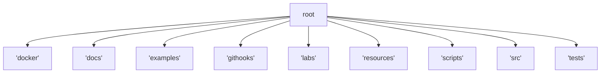

# Project Architecture

This file is generated from [docs/adr/0007-refined-project-structure.md](docs/adr/0007-refined-project-structure.md).

## Directory Overview

| Path | Purpose |
| ---- | ------- |
| `/docker/` | Docker build contexts and compose files |
| `/docs/` | Architecture, ADRs and operational guides |
| `/examples/` | Minimal reproducible scripts and integration samples |
| `/githooks/` | Project-specific Git hooks |
| `/labs/` | Experimental notebooks and throwaway prototypes |
| `/resources/` | Static assets like images and SQL fixtures |
| `/scripts/` | Setup and maintenance utilities |
| `/src/` | Application source code |
| `/tests/` | Unit and integration tests |

For component relations see [docs/architecture.md](docs/architecture.md).
