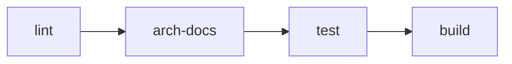

# CI and Automation Workflows

This document summarizes the GitHub Actions workflows located under `.github/workflows`. They automate linting, testing, Docker builds and several quality checks.

## 1. `ci.yml`

The main pipeline runs on pushes to `main` and on pull requests. It defines four sequential jobs:

1. **lint** – installs Python and Node dependencies, runs `pre-commit` and the frontend linter, then verifies generated TypeScript definitions.
2. **arch-docs** – generates `ARCHITECTURE.md` via `python scripts/generate_arch_docs.py` and fails if changes are detected.
3. **test** – waits for `arch-docs`, sets up a matrix for Python 3.10–3.12 and runs both backend (`pytest`) and frontend tests.
4. **build** – runs only for tagged commits after successful tests. It logs in to GHCR and uses `docker/build-push-action` to build `docker/backend_service/Dockerfile` and push the resulting image tagged with the Git ref name.

Build artifacts created during this job are stored in the `build/` directory. The folder is cleaned after each run and is ignored by Git.

## 2. `quality-audit.yml`

A weekly scheduled job that installs dependencies, runs tests with coverage, performs Lighthouse audits and a Snyk vulnerability scan. Results (coverage, performance metrics, open bug count and vulnerabilities) are summarized and sent to Slack.

## 3. `contract-testing.yml`

Triggered on pushes and pull requests, this workflow runs consumer pact tests for the React app and publishes pacts to a broker. A provider verification job then checks the backend against the broker.

## 4. `performance.yml`

Executed on pull requests to measure frontend performance. It builds the React app and uses `treosh/lighthouse-ci-action` with `lighthouseci.config.js` to upload artifacts.

## 5. `checklist.yml`

Checks pull request descriptions for incomplete task lists. If any unchecked items remain, a bot comment reminds the contributor.

## Notes on additional YAML files

No `docs/performance.yml` exists in this repository. The `performance.yml` workflow described above is located under `.github/workflows/`.
