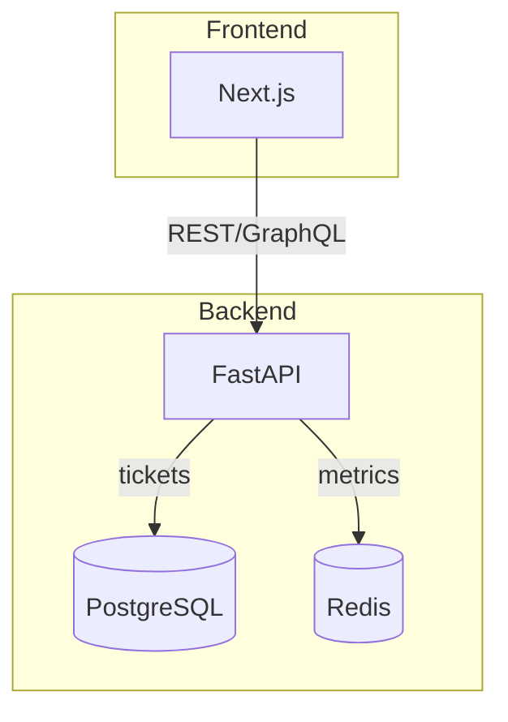

# Onboarding Guide

Welcome to the GLPI Dashboard project. This guide helps you set up the development environment and understand the repository structure.

## Overview

The dashboard aggregates GLPI service desk metrics using a FastAPI backend and a Next.js frontend. Postgres stores ticket data and Redis caches frequent queries.

## Getting Started

1. Copy the environment template:

   ```bash
   cp .env.example .env
   ```

   Ensure the Docker Compose plugin is installed. The `docker compose` command
   requires Docker Engine 20.10+ or the `docker-compose-plugin` package.

2. Start the stack:

   ```bash
   docker compose -f docker-compose-dev.yml up --build
   ```

3. Access the frontend at <http://localhost:5173> and the API at <http://localhost:8000>.

## Folder Layout

```text
├── src/           # backend source code
├── frontend/      # Next.js application
├── docs/          # documentation and ADRs
├── monitoring/    # Prometheus/Grafana config
└── tests/         # pytest suite
```

ADRs live in `docs/adr`. Use `./scripts/adr-new` to add new decisions.

## Architecture Diagram



This diagram illustrates the logical view of the system; the development view aligns with the folder layout above.
