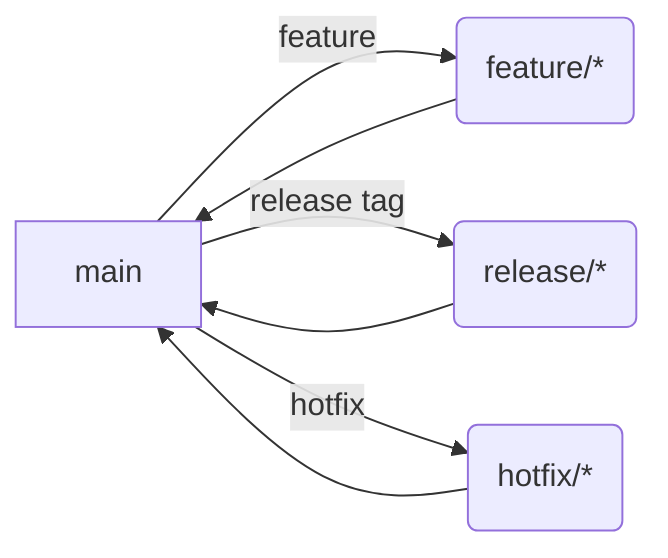

# Release Process

We follow a simplified GitFlow strategy. Development happens on short-lived branches cut from `main`.

## Branch Naming

- `feature/<name>` for new features
- `hotfix/<name>` for urgent fixes on production
- `release/<version>` to prepare a stable version

## Versioning

Semantic Versioning is used: `MAJOR.MINOR.PATCH`.
- Increment **MAJOR** for incompatible API changes
- Increment **MINOR** for new backward-compatible functionality
- Increment **PATCH** for bug fixes

## Workflow



Example release commands:

```bash
git checkout main
git pull
git checkout -b release/1.2.3
# update changelog
git commit -am "Release 1.2.3"
git tag -a v1.2.3 -m "Release 1.2.3"
git push origin release/1.2.3 --tags
```
