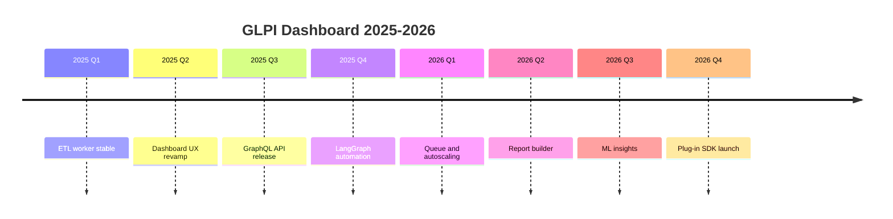

# 2025-2026 Roadmap

This roadmap outlines the high-level themes for each quarter, key initiatives and KPIs to track progress.

## Quarterly Themes

| Quarter   | Theme                         | Initiatives                                                                                     | KPIs                            |
|-----------|-------------------------------|-------------------------------------------------------------------------------------------------|---------------------------------|
| **2025 Q1** | Data Pipeline Hardening      | - Finalize ETL worker - Add cache layer - Verify GLPI token rotation                       | 95% ETL success rate            |
| **2025 Q2** | Dashboard Optimization       | - Refactor React charts - Add SLA widgets - Improve UX for mobile                         | <50 ms chart render time        |
| **2025 Q3** | API Extensibility            | - Publish GraphQL endpoints - Document REST wrappers - Provide API client samples         | 100% endpoint coverage in docs  |
| **2025 Q4** | Multi-Agent Automation       | - Deploy LangGraph pipeline - Automate ticket categorization - Implement self-healing     | 80% auto categorization accuracy|
| **2026 Q1** | Scalability & Resilience     | - Introduce message queue - Deploy worker autoscaling - Add monitoring dashboards         | 99% API uptime                  |
| **2026 Q2** | Self-Service Analytics       | - Release custom report builder - Integrate export to CSV/Excel                              | 30% reduction in ad hoc queries |
| **2026 Q3** | Predictive Insights          | - Train ML model on backlog trends - Expose anomaly alerts                                   | Alert precision >85%            |
| **2026 Q4** | Community & Extensions       | - Offer plug‑in SDK - Publish contribution guide - Conduct user feedback survey           | 50 active external contributors |

## Timeline

## Priority Rationale

The roadmap prioritizes data reliability and user experience before expanding into predictive analytics. Solidifying the ETL pipeline and optimizing the dashboard early ensures stable foundations. Automation and self-service features then empower teams to act on insights without manual steps. Finally, community extensions encourage adoption and long-term sustainability.
