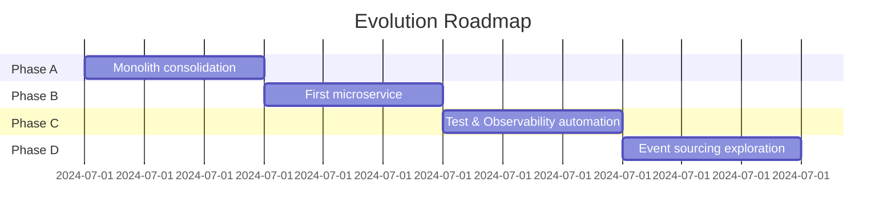

# Technical Roadmap 0-12 Months

| Phase | Goal | Exit Criteria |
|-------|------|---------------|
|A|Stabilize monolith with Clean Architecture|85% unit test coverage|
|B|Extract first service once backlog stabilizes|Service deployed with <5% error rate|
|C|Automate testing and monitoring|CI runtime <10m, dashboards active|
|D|Evaluate event sourcing or CQRS|ADR approved and prototype demo|
